# Architecture

## High-Level Shape

The application is a single-page browser app. It uses p5.js for canvas/UI lifecycle and p5.sound for audio loading, playback, effects, and FFT visualizations. It also has a progressive web app layer for optional installation while keeping normal web usage unchanged.

There is no module loader or ES module migration. App-owned scripts still rely on classic browser globals and script order. For browser testing, `index.html` loads p5 and p5.sound directly, then loads `dist/app.bundle.min.js`, which is generated by concatenating the app-owned scripts in the same order and minifying the result with `terser`.

## Source Map

| File | Responsibility |
| --- | --- |
| `index.html` | HTML shell, p5/p5.sound loading, app bundle loading, PWA manifest/service worker registration, and canvas mount. The old lyrics DOM is commented out until that feature returns. |
| `manifest.webmanifest` | PWA install metadata: app name, display mode, orientation, colors, and icon references. |
| `sw.js` | Conservative service worker that caches only the local app shell and leaves Subsonic/audio requests network-only. |
| `dist/build-bundle.sh` | Build helper that concatenates app-owned scripts into `dist/app.bundle.js`, then uses local `terser` tooling to create `dist/app.bundle.min.js`. |
| `dist/.tools/` | Local npm prefix for build tools such as `terser`; not used by the runtime app and safe to regenerate with `npm install --prefix dist/.tools terser`. |
| `lib/theme.js` | Central theme registry, active `UI` palette, CSS variable application, and theme toggle helpers. |
| `lib/sketch.js` | Main p5 sketch, setup flow, playback, playlists, and high-level orchestration. |
| `lib/layoutmanager.js` | Owns panel layout, layout drag/resize state, element-panel ownership, and layout serialization. |
| `lib/audioeffects.js` | Owns p5.sound routing, three-band EQ, reverb, volume, balance, rate, and change-gated audio parameter updates. |
| `lib/subsonic.js` | Subsonic REST client, token auth query generation, response normalization. Lyrics API support is commented out for now. |
| `lib/filebrowser.js` | Browses Subsonic indexes and music directories. Adds selected songs to the local playlist. |
| `lib/player.js` | Loads streams, owns the active `p5.SoundFile`, and advances playback. |
| `lib/playercontrol.js` | Owns the PREV/PLAY/PAUSE/STOP/NEXT DOM image buttons, styling, positioning, and layout metadata. |
| `lib/userappcontrol.js` | Owns the theme, fullscreen, and logout controls, including drawing, hit-testing, fullscreen listener state, and layout metadata. |
| `lib/textlistbox.js` | Reusable p5 fixed-row text/list box with truncation, scroll, scrollbar drag, and bottom-stick behavior. |
| `lib/telemetrylog.js` | Shared DATA FEED event buffer with timestamps, max-entry trimming, throttle, and dedupe. |
| `lib/telemetrypanel.js` | Panel-bound DATA FEED renderer that formats telemetry entries through `TextListBox`. |
| `lib/playlist.js` | Local in-browser playlist queue, pointer navigation, list drawing, scrollbar handling. |
| `lib/playinginfo.js` | Current song metadata and cover art display. |
| `lib/progressbar.js` | Song-position progress bar and seek interaction. |
| `lib/spectrum.js` | FFT spectrum visualization. |
| `lib/waveform.js` | FFT waveform visualization. |
| `lib/vumeters.js` | Output-aware stereo VU meter visualization. |
| `lib/vectorscope.js` | Output-bus stereo phase/correlation visualization. |
| `lib/slider_v.js` | Vertical slider control used by volume, EQ, and reverb. |
| `lib/slider_h.js` | Horizontal slider control used by balance and playback speed. |
| `lib/switch.js` | Toggle controls for filters, playlist looping, panel movement, and element movement. |

### Component Overview

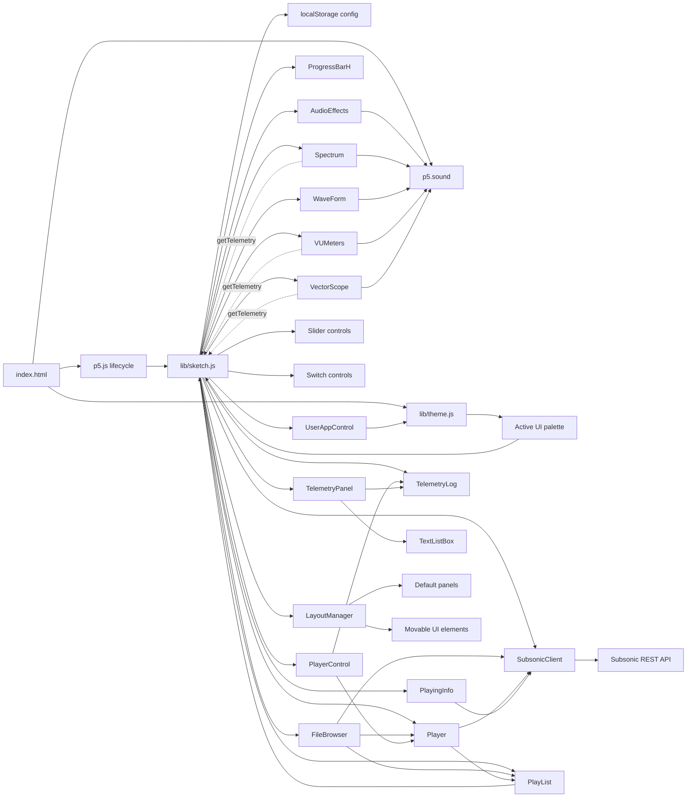

## Startup Flow

1. Browser opens `index.html`.
2. Scripts load in the order declared in the HTML.
3. p5 calls `preload()`, which loads `assets/dot.mp3` as a placeholder sound.
4. p5 calls `setup()`.
5. `setup()` checks `localStorage` for `subsonicPlayerConfig`.
6. If config is missing, the app stops the p5 loop and shows a setup form.
7. On form submit, the app creates a salt, hashes `password + salt` with MD5, and checks the candidate credentials with a Subsonic `ping`.
8. Only accepted credentials are stored as `server`, `user`, `token`, and `salt`; rejected credentials keep the setup form visible.
9. With accepted config present, `setup()` waits for the async credential check before creating the player UI.
10. `initializePlayer()` creates `SubsonicClient`, sizes the canvas to the available viewport, creates controls, visualizers, playlist, file browser, applies saved layout data, and starts loading playlists/indexes.
11. The draw loop renders the full deck only after `appReady` is true. Before that it shows a startup/status screen, which avoids half-rendered empty panels during async startup.

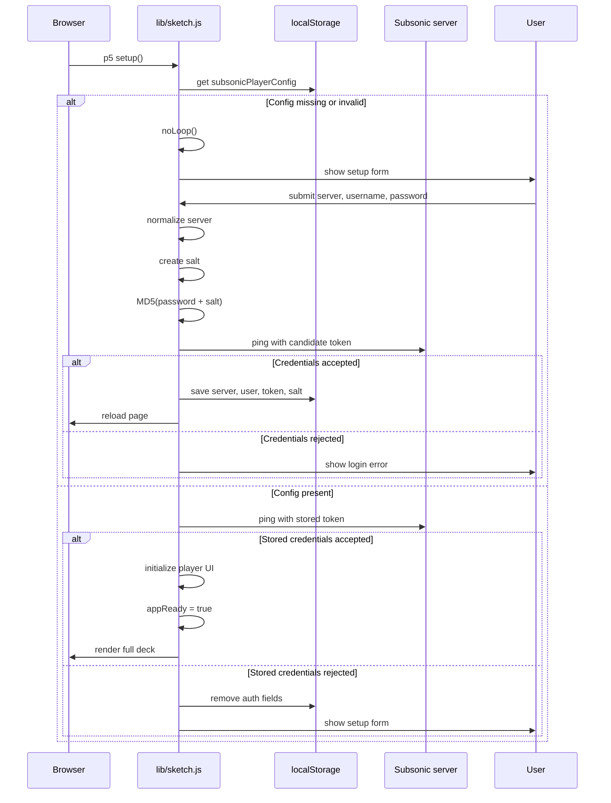

## PWA Model

The PWA layer is progressive: unsupported browsers, `file://` use, and non-secure non-localhost origins continue to run the app as a normal web page. On HTTPS or localhost, `index.html` registers `sw.js` after window load.

`sw.js` uses a versioned app-shell cache. It precaches local static files and removes older cache versions on activation. Navigations try the network first and fall back to cached `index.html`; local static files use cache-first behavior. Requests outside the app origin, audio requests, and Subsonic-style paths such as `/rest/`, `/stream`, `/download`, and `/getCoverArt` are not intercepted, so authenticated media and API traffic remain controlled by the normal network flow.

## App Bundle

The current browser test path keeps third-party libraries separate:

- `lib/p5.js`
- `lib/p5.sound.js`

All app-owned scripts are concatenated in the same order previously listed in `index.html`. This preserves the existing global-mode p5 callbacks such as `preload()`, `setup()`, and `draw()`, as well as the app's class/global sharing across files.

Build command:

```bash
./dist/build-bundle.sh
```

Outputs:

```text
dist/app.bundle.js
dist/app.bundle.min.js
```

`dist/app.bundle.min.js` is produced with `terser`. The local `terser` install lives under `dist/.tools/`; if that directory is missing, recreate it with:

```bash
npm install --prefix dist/.tools terser
```

## Authentication Model

Subsonic token authentication uses:

```text
token = md5(password + salt)
```

Requests send:

```text
u=<user>&t=<token>&s=<salt>&v=<api-version>&c=<client>&f=json
```

The password is used only at setup time and is not stored by the app.
The generated token and salt are stored in browser `localStorage`, so they should be treated as local browser credentials. Prefer HTTPS for remote Subsonic servers and use the deck from a trusted browser profile.

`Logout` removes the stored auth fields, clears saved layout data (`layout` and `layoutOwners`), clears the saved queue (`queueState`), and reloads the page. The next sign-in starts from the current default panel arrangement.

The selected theme is also stored in `subsonicPlayerConfig.theme`. It is intentionally kept when logging out.

## Queue Persistence

The local queue persists through `subsonicPlayerConfig.queueState`. `PlayList` owns queue serialization through `getPersistedState()` and restoration through `restorePersistedState()`, while `lib/sketch.js` owns storage writes through the existing app config helpers.

Persisted queue state is versioned and tied to the current `server` and `user`, so a queue from one Subsonic account is not restored into another. The stored payload contains compact track metadata and the queue pointer only. It deliberately excludes stream URLs, tokens, p5.SoundFile objects, decoded audio buffers, cover image pixels, and DATA FEED history.

Queue writes are debounced to avoid repeated `localStorage` writes during folder adds or batch mutations. A `beforeunload` flush writes the last pending snapshot before refresh. Restoring the queue never starts playback automatically.

## API Boundary

`SubsonicClient.request()` is the central API boundary. It:

- Builds `/rest/<endpoint>` URLs.
- Adds authentication and JSON response parameters.
- Encodes query parameters through `URLSearchParams`.
- Checks HTTP status.
- Checks for a `subsonic-response` object.
- Returns the Subsonic response for successful calls.
- Logs failures and returns `null`.

Higher-level methods convert nullable or singleton response fields into predictable shapes. For example:

- `getIndexes()` returns `{ index: [], child: [] }`.
- `getPlaylist()` returns an object with `entry: []`.
- List endpoints return arrays.

This keeps UI code from crashing when the server is unavailable, credentials fail, or the API returns a singleton where an array is expected.

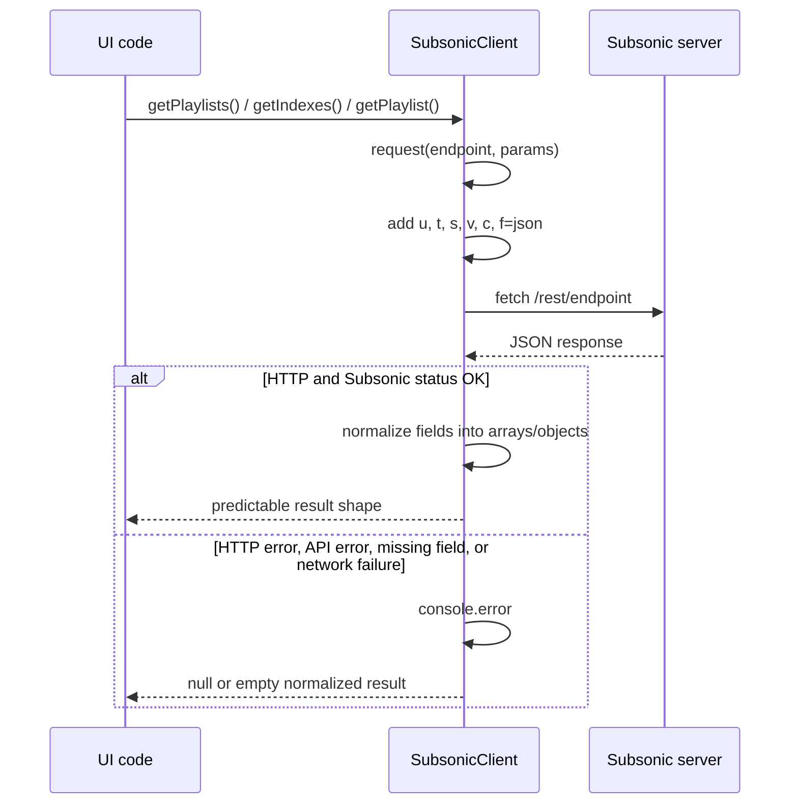

## Playback Model

The app keeps one global `song` reference for the currently loaded `p5.SoundFile`.

Playback is centered on `Player` in `lib/player.js`:

- `playSongById(id)`: validates the song against the local playlist, builds the stream URL, loads it with `loadSound()`, and starts playback.
- `playSong()`: plays the currently loaded `p5.SoundFile`.
- `pauseSong()` and `stopSong()`: control current playback.
- `playNext()`: advances the local `PlayList` pointer when continuous playback is enabled. If random play is enabled, `PlayList.next()` chooses a random unplayed candidate without reordering the visible queue.
- `getSoundObject()`: exposes a newly loaded sound once so `lib/sketch.js` can route it through the audio graph.

The local playlist is separate from the server playlist. `PlayList` stores the current queue in the browser and tracks a pointer to the current song.

Clicking a visible row in the queue resolves the row with `PlayList.getItemIndexAt(mx, my)` and calls `Player.playSongByPlaylistId(index)`. That updates the queue pointer, starts the selected song, and leaves normal `playNext()` behavior intact so playback continues through the rest of the queue.

Random play is intentionally not a queue shuffle. It leaves the queue order intact and changes only how `next()` selects the next pointer.
When `Loop Playlist` is off, random play stops after its current random candidate round is exhausted. When loop is on, it starts a new random round.

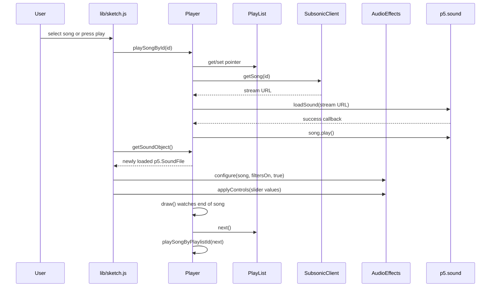

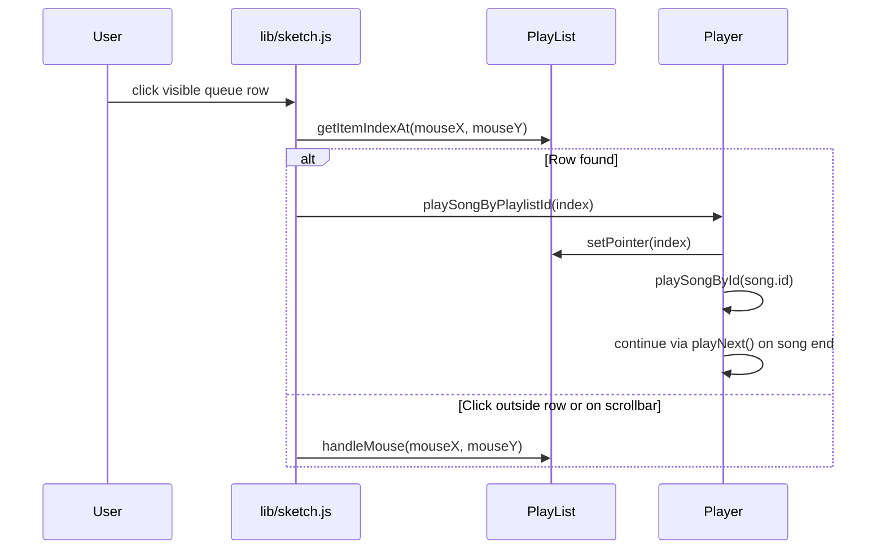

## Audio Graph

When filters are enabled, the loaded song is disconnected from the master output and connected into three band-pass paths:

- Bass band-pass -> bass gain -> master
- Mid band-pass -> mid gain -> master
- Treble band-pass -> treble gain -> master
- Reverb processes the current song with its own wet/dry and gain controls.

`AudioEffects.configure()` rebuilds this graph only when the active song changes or the filter on/off switch changes. This avoids repeatedly stacking `p5.Reverb.process()` paths while a user moves sliders.

When filters are disabled, `AudioEffects` uses a direct song -> master route and does not create `p5.Reverb`. This keeps the Firefox WebAudio graph smaller during long sessions. `Player` also suspends the shared p5.sound `AudioContext` after idle pause/stop and resumes it before playback so Firefox `GraphRunner` can sleep when the deck is not producing audio.

Long Firefox playback sessions use a periodic maintenance path in `Player.performMaintenance()`. After every 50 completed playbacks, `Player` inserts a short maintenance gap before loading the next stream. During that gap it detaches and disposes the ended `p5.SoundFile`, clears p5.sound internals, briefly suspends the shared `AudioContext`, and emits a `SYSTEM` DATA FEED entry. `lib/sketch.js` handles the maintenance callback by rebuilding app-owned audio helpers such as `AudioEffects` and visualizer audio nodes.

`VU METERS` is included in this maintenance path because its implementation differs from the other visualizers: it uses `p5.Amplitude`, which creates an AudioWorklet connected to `p5.soundOut.meter`. `VUMeters.recycleAudioNodes()` replaces that meter worklet without recreating the visible panel. Spectrum, waveform, and vector scope are mostly analyzer/readout panels and are therefore only recycled if they later expose the same maintenance hook.

`lib/sketch.js` reads the slider values and passes them to `AudioEffects` as plain control data. Sliders update volume, balance, rate, bass, mid, treble, reverb mix, and reverb gain. Values are applied only when they change, and gain changes use a short ramp to reduce clicks.

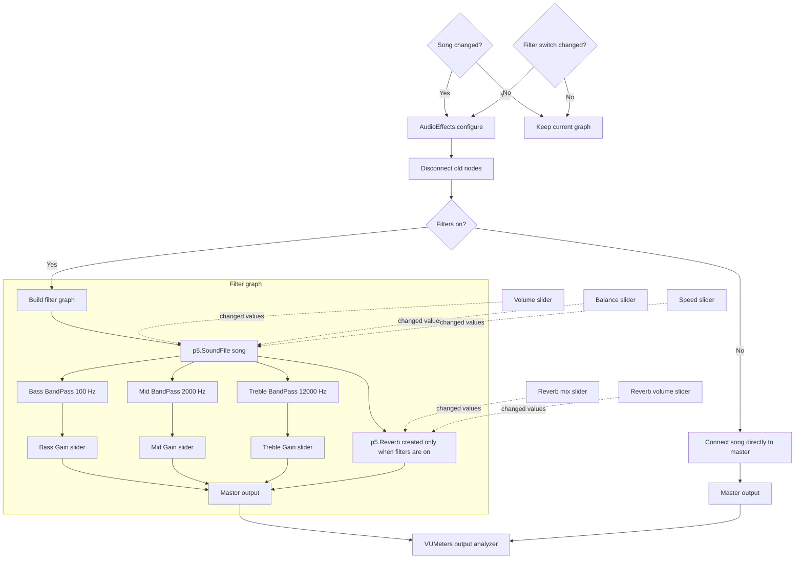

## Slider Interaction

`SliderH` and `SliderV` support three interaction styles:

- Drag the handle.
- Click anywhere on the slider track to jump to that value.
- Use the mouse wheel while hovering over the slider.

Scrollable canvas list surfaces also consume wheel input while hovered. `BROWSER`, `QUEUE`, and `DATA FEED` use the wheel for row/history navigation before the event can reach the browser page. `BROWSER` and `QUEUE` are panel-bound components: moving or resizing their panels refits the list viewport, toolbar, scrollbar, and scroll offset.

`BROWSER` keeps normal click as the play-now/navigation action. Folder rows are prefixed with `🗀`, song rows are prefixed with `♪`, and Shift+Click or the browser `+` toolbar mode appends songs to `QUEUE` without stopping the current playback. When the target is a folder, `FileBrowser` recursively reads Subsonic directory children with `getMusicDirectory()` and appends every song it finds.

`QUEUE` keeps normal click as the play-from-here action. The queue toolbar `X` clears the full queue, Shift+Click removes the clicked queued item, and toolbar `-` mode makes row clicks remove queued items without interrupting the active audio buffer.

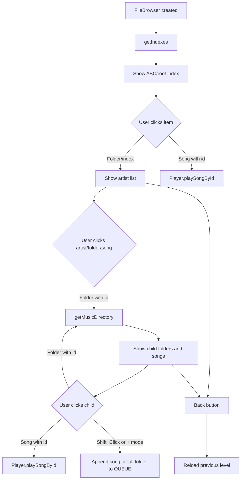

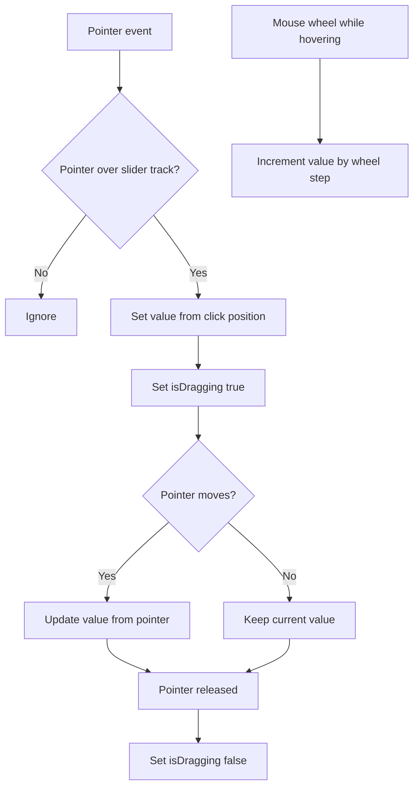

## UI Model

Most UI is drawn on the p5 canvas. Some p5-created HTML elements are positioned over the page:

- Playback image buttons.
- Playlist selector.
- Song selector.

The visual presentation is driven by `lib/theme.js`. `SUBMARINE` is the default deep blue deck with yellow and green signal accents, `CYBER` is a dark neon variant, `STELLAR` is a light pastel variant with similar accents, `FALLOUT` is a warm terminal-style deck with orange signal glow and green accents, `MATRIX` is a black-and-green terminal variant, and `VOLCANO` is a lava-red variant with orange signal heat. `index.html` only consumes CSS variables for the page shell, background, and canvas container; `lib/theme.js` owns and applies the actual theme values as soon as it loads. Canvas components read from `UI`, while `lib/sketch.js` subscribes to theme changes to restyle live DOM controls and slider accent colors.

The canvas uses the visible viewport size instead of enforcing a fixed desktop minimum. It resizes on `windowResized()` so the deck stays inside the available screen and avoids page scroll. Avoiding page scroll matters on touch devices because drag gestures should move deck panels/elements, not the browser page.

The current responsive target is desktop and tablet. The full deck can remain usable on a 10-inch tablet when `Skinny` is enabled and filters are disabled, because fewer analyzer-backed panels are visible and touch drag does not compete with page scrolling. Smartphone support is deferred; it should likely be a separate view-based UI rather than a scaled-down deck.

The lyrics feature is currently parked. The old DOM column, `Show Lyrics` switch, `loadLyrics()` workflow, and `SubsonicClient.getLyrics()` method remain in comments with TODO markers, but no active runtime path calls the external lyrics API or reserves canvas space for that column.

### DATA FEED And Text Surfaces

`DATA FEED` is the first reusable text-oriented panel in the deck. It is still canvas-first: the log is drawn with p5 instead of using a DOM `<textarea>`, so it participates naturally in the panel layout and theme system.

The telemetry path is split into three layers:

- `TelemetryLog` stores entries and owns `emit(source, message, options)`. It adds timestamps, limits buffer size, throttles noisy sources, and deduplicates repeated messages.
- `TelemetryPanel` formats entries and renders the panel content.
- `TextListBox` draws the fixed-row text box, truncates long lines, handles mouse wheel scrolling, and supports scrollbar dragging.

`SYSTEM` entries render full date and time. Other sources render only time so repeated audio and analyzer logs stay readable in narrow panels.

Continuous analyzer values are not pushed directly from `draw()` methods. Instead, visual modules expose data through `getTelemetry()` and `lib/sketch.js` samples those values on a timer, converting them into log entries. This keeps modules such as `Spectrum`, `VUMeters`, and `VectorScope` responsible for audio measurements, while `TelemetryLog` and the sampler decide what becomes visible text.

When the user scrolls or drags the DATA FEED scrollbar upward, `TextListBox` pins the view to history and stops forcing autoscroll. Returning to the bottom resumes normal bottom-stick behavior as new entries arrive.

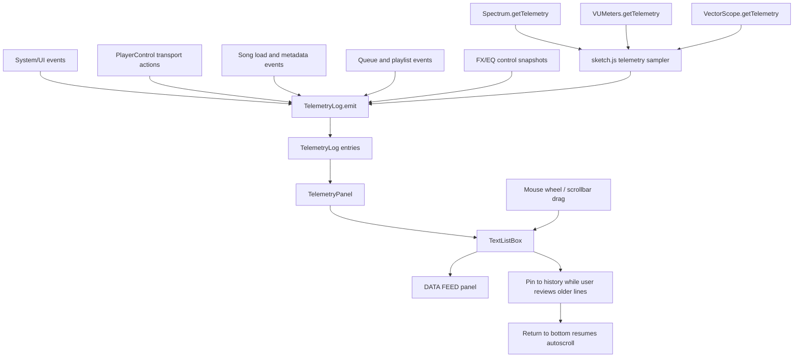

## Layout Model

The canvas layout is split between panels and movable elements:

- `LayoutManager.getDefaultPanels()`: developer-facing source of default panel rectangles with `key`, `x`, `y`, `w`, `h`, `label`, and accent color. Add new default panels there.
- p5-drawn controls: sliders, switches, visualizers, file browser, queue, progress bar, and `PlayingInfo`.
- p5-created DOM controls: transport buttons, playlist select, and song select.

The DOM controls are parented to `#cnv`, whose CSS uses `position: relative`. This makes their p5 `position(x, y)` coordinates align with canvas coordinates instead of page-level coordinates.

`lib/layoutmanager.js` owns the layout engine: panel drag state, resize state, element ownership, hit-testing, full-layout serialization, and edit overlays. `lib/sketch.js` provides generic movable item adapters for the live components and delegates the layout mechanics to `LayoutManager`.

### Layout Editing Switches

The deck has two runtime layout-editing tools:

- `Move Panels`: enables panel dragging and panel resizing.
- `Move Elements`: enables individual controls to move between panels.

When both switches are off, the app behaves normally and the layout is locked. Turning either switch off after editing persists layout data into `subsonicPlayerConfig.layout` and element ownership into `subsonicPlayerConfig.layoutOwners`.

The `USER CONTROL` panel contains the theme toggle, `Move Panels`, `Move Elements`, `Full`, and `Logout` controls. The theme toggle cycles through `CYBER`, `STELLAR`, `FALLOUT`, `SUBMARINE`, `MATRIX`, and `VOLCANO`, then stores the result in browser storage. `Full` toggles browser fullscreen mode through the Fullscreen API and resize handling updates the canvas after fullscreen changes. It participates in the same movable panel model as the other panels, so moving the panel also moves controls owned by it.

While either edit switch is active, the app disables pointer events on the DOM controls so the canvas receives drag events. This means buttons and selects are movable rather than usable during layout editing.

Dragging a panel moves the panel and any element currently owned by that panel. Ownership is explicit, which prevents overlapping panels from accidentally stealing each other's controls. Individual controls can only be moved between panels when `Move Elements` is enabled; when released, their owner is updated from the panel under their center.

Panel headers are prioritized over controls inside the panel during layout editing. This matters for compact panels such as `POSITION`, where the progress bar can overlap much of the panel body; grabbing the header still selects the panel itself.

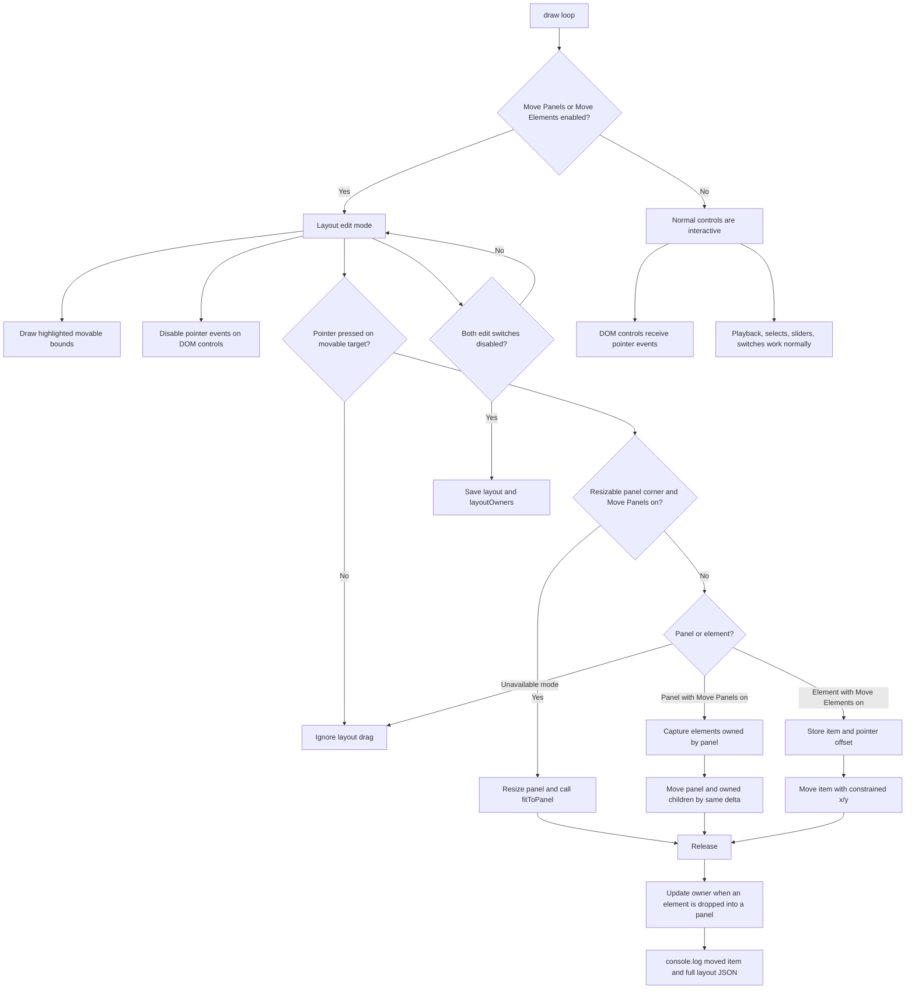

The `SPECTRUM`, `WAVEFORM`, `VU METERS`, `PHASE`, and `POSITION` panels expose a resize grip in their bottom-right corner while `Move Panels` is active. Dragging that corner resizes the panel and calls the matching component's `fitToPanel()` method so the plot or progress bar fills the available panel space. Minimum sizes live in the corresponding component modules instead of being hard-coded in `lib/sketch.js`.

`DATA FEED` is also panel-bound and resizable. Its minimum size and inner text-box fitting live in `TelemetryPanel`; the generic row/scroll behavior lives in `TextListBox`.

Visualizers can be marked inactive by their modules. `LayoutManager` asks the panel-bound component for `isInactive()` and omits inactive panels from drawing, resize handles, and panel dragging, while still keeping their saved/default layout data available.

When an element is released, `LayoutManager` logs its new position and the full layout JSON to the browser console.

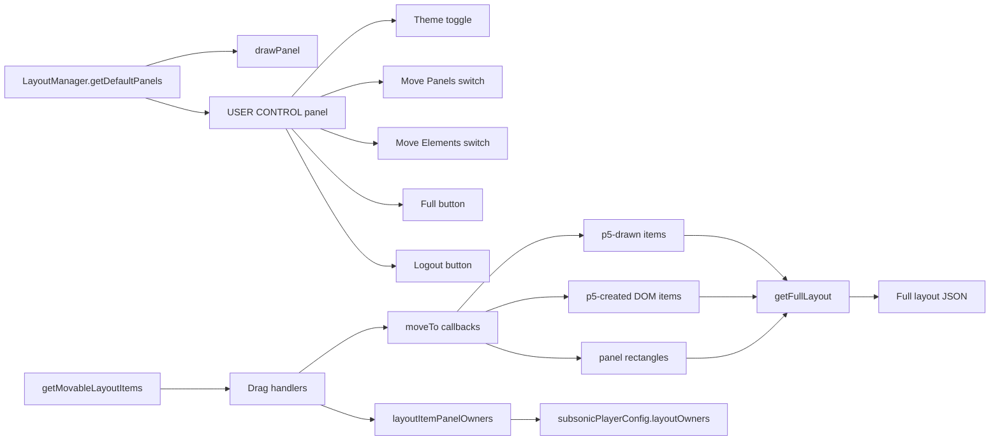

Saved layout entries are restored with their persisted coordinates, even when those coordinates are outside the currently visible canvas. This preserves the user's exact fullscreen layout instead of crowding panels against the windowed viewport edges.

Developers can also call:

```js
logFullLayout()
getFullLayout()
logPanelLayout()
getPanelLayout()
setPanelLayoutEditMode(true)
setPanelLayoutEditMode(false)
```

`getFullLayout()` reports both panels and movable controls. `getPanelLayout()` reports only the panel rectangles. A normal user does not need these APIs; they exist to tune the UI and either persist the result in browser storage or hard-code preferred coordinates back into `LayoutManager.getDefaultPanels()`.

### Skinny Mode

`Skinny` lives in the `TRANSPORT` panel and persists as `subsonicPlayerConfig.skinnyMode`. It is a low-power mode for tablets and slower devices where the audio path can stutter when both filters and analyzer-backed drawings are active.

When `Skinny` is ON:

- `SPECTRUM` is hidden, skipped by the main draw loop, and its `p5.FFT` analyzer is disconnected from `p5.soundOut.fftMeter`.
- `WAVEFORM` is hidden, skipped by the main draw loop, and its `p5.FFT` analyzer is disconnected from `p5.soundOut.fftMeter`.
- `VU METERS` is hidden, skipped by the main draw loop, and its `p5.Amplitude` worklet is disconnected from `p5.soundOut.meter`.
- `PHASE`/`VectorScope` is hidden, skipped by the main draw loop, and its Web Audio analyser tap is disconnected from `p5.soundOut.input`.
- `LayoutManager` omits those inactive panels from drawing, resize handles, panel dragging, and panel-bound hitboxes.

When `Skinny` is OFF, those modules reconnect their analyzers and return to their normal draw path. Skinny mode does not disable playback, transport controls, source controls, queue/browser drawing, progress, layout switches, theme controls, or audio filters; filters remain controlled by the separate `Filters` switch.

## Visualization Modules

Audio visualizers are intentionally module-owned:

- `Spectrum` owns its FFT drawing, responsive bar sizing, panel fit behavior, and minimum panel size.
- `WaveForm` owns waveform drawing, panel fit behavior, and minimum panel size.
- `VUMeters` owns stereo output metering, peak smoothing, panel fit behavior, and minimum panel size.
- `VectorScope` owns stereo correlation, phase drawing, panel fit behavior, and minimum panel size.
- `ProgressBarH` owns song-position drawing, seek interaction, panel fit behavior, and minimum panel size.

Analyzer modules may expose `getTelemetry()` for the central telemetry sampler. These methods return structured values rather than formatted strings, keeping log presentation out of visualizer modules.

`lib/sketch.js` acts as the orchestrator: it creates the modules, asks them to draw, and calls `fitToPanel()` when their panel changes. Component-specific geometry rules stay in each module so the main sketch remains focused on lifecycle, input routing, and audio graph coordination.

## Data Relationships

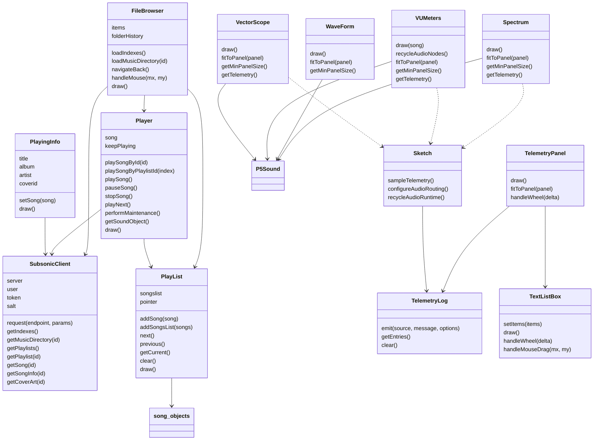

## Error Handling Philosophy

The current implementation favors local resilience:

- Log API failures to the console.
- Return empty arrays or empty objects from data wrappers.
- Avoid playing songs with missing IDs.
- Avoid rendering crashes by falling back to `Untitled` or blank strings.
- Use a generated fallback cover when cover art is missing or fails to load.

This keeps the player usable enough to recover from bad data without forcing a full app restart.
