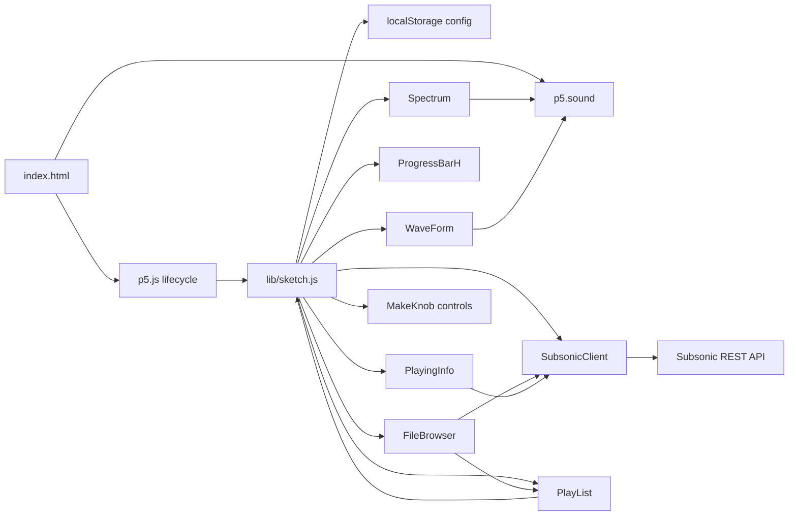
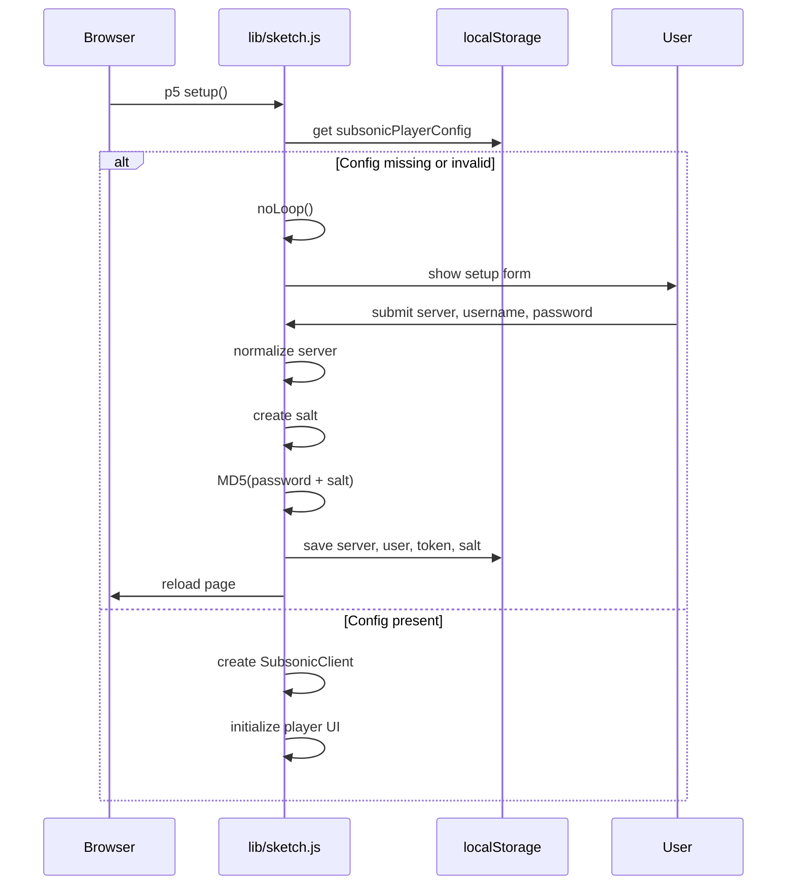
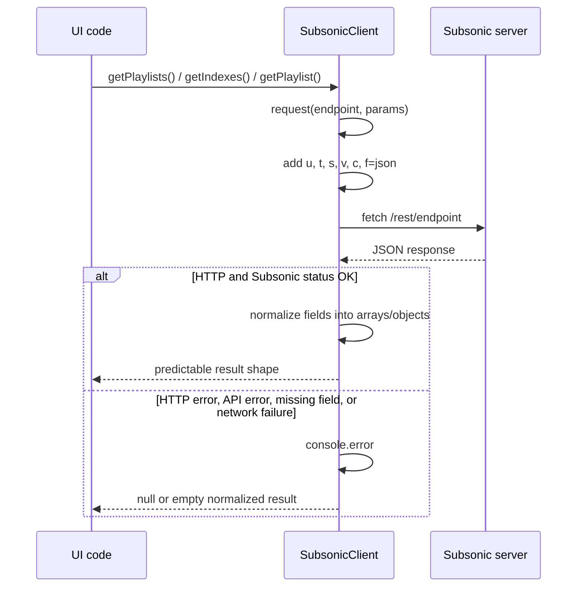
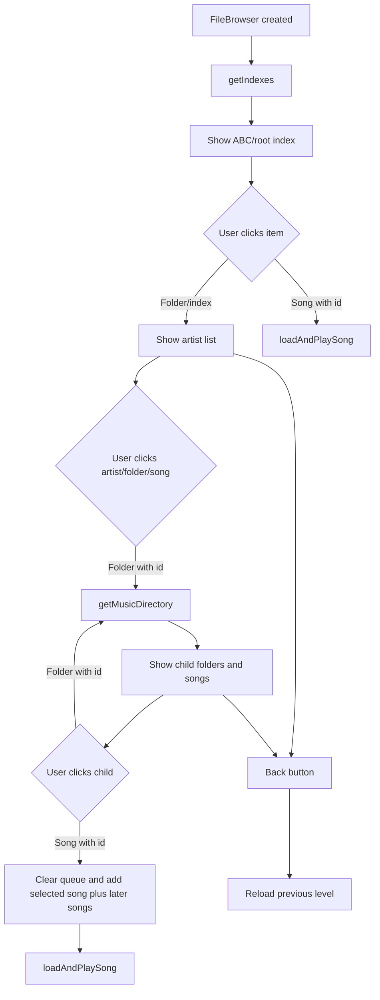
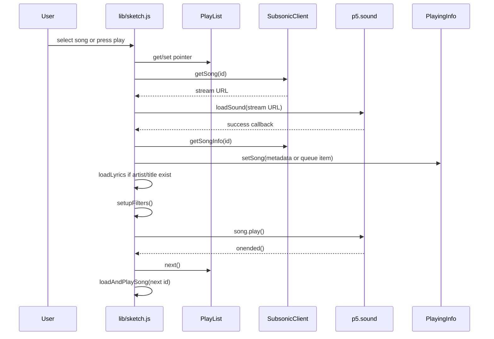
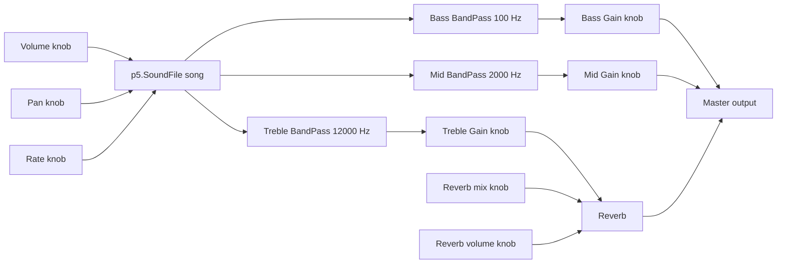

# Inner Workings Diagrams

These diagrams use Mermaid syntax. Many Markdown renderers, including GitHub, can display them directly.

## Component Overview



## First-Run Configuration



## API Request Flow



## Music Browser Flow



## Playback Flow



## Audio Routing



## Local Data Relationships

```mermaid
classDiagram
    class SubsonicClient {
        server
        user
        token
        salt
        request(endpoint, params)
        getIndexes()
        getMusicDirectory(id)
        getPlaylists()
        getPlaylist(id)
        getSong(id)
        getSongInfo(id)
        getLyrics(artist, title)
        getCoverArt(id)
    }

    class FileBrowser {
        items
        folderHistory
        loadIndexes()
        loadMusicDirectory(id)
        navigateBack()
        handleMouse(mx, my)
        draw()
    }

    class PlayList {
        songslist
        pointer
        addSong(song)
        addSongsList(songs)
        next()
        previous()
        getCurrent()
        clear()
        draw()
    }

    class PlayingInfo {
        title
        album
        artist
        coverid
        setSong(song)
        draw()
    }

    FileBrowser --> SubsonicClient
    FileBrowser --> PlayList
    PlayingInfo --> SubsonicClient
    PlayList --> "song objects"
```

