# Inner Workings Diagrams

These diagrams use Mermaid syntax. Many Markdown renderers, including GitHub, can display them directly.

## Component Overview

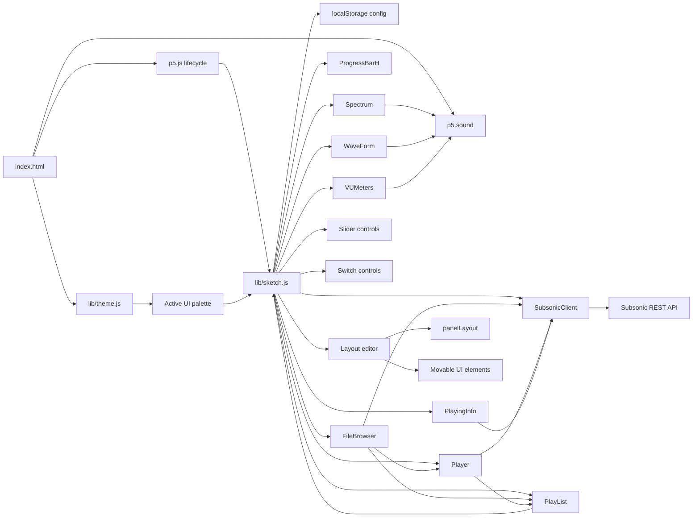

## First-Run Configuration

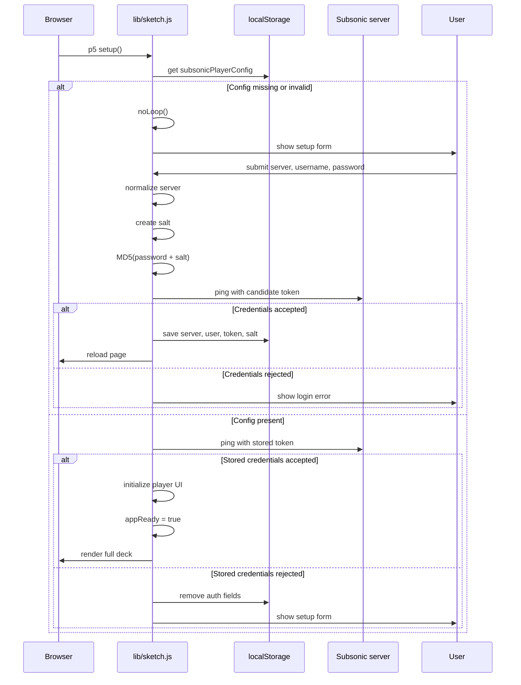

The canvas draw loop checks `appReady` before rendering the deck. Until initialization finishes, it shows a startup/status message instead of drawing partial panels.

## API Request Flow

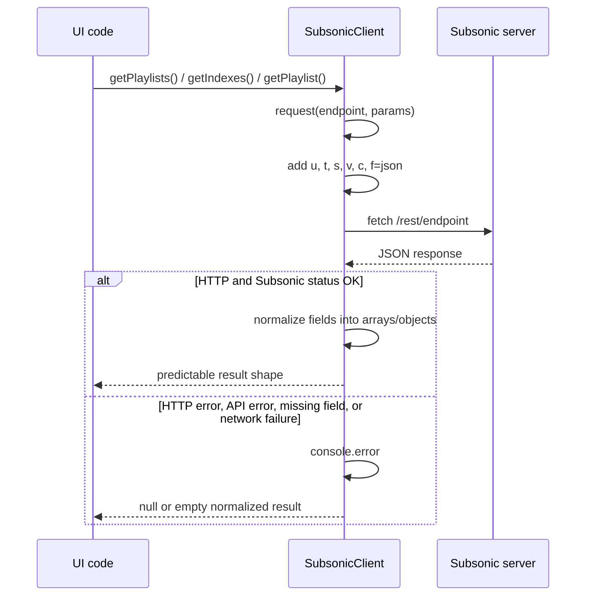

## Music Browser Flow

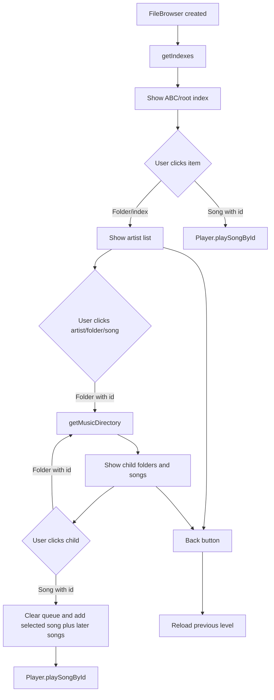

## Playback Flow

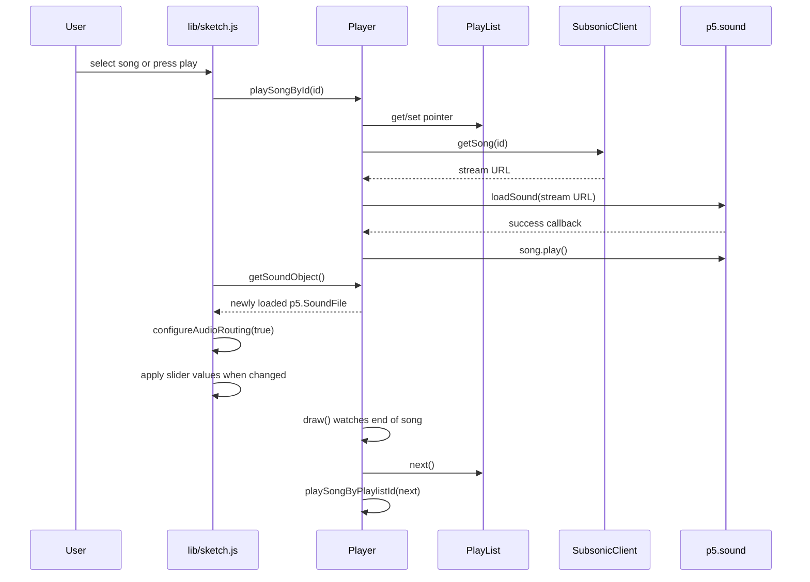

## Queue Click-To-Play

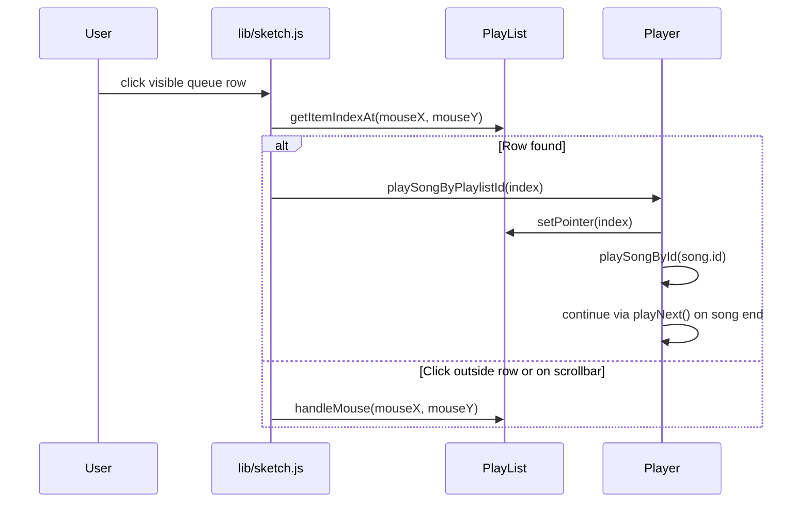

## Slider Interaction

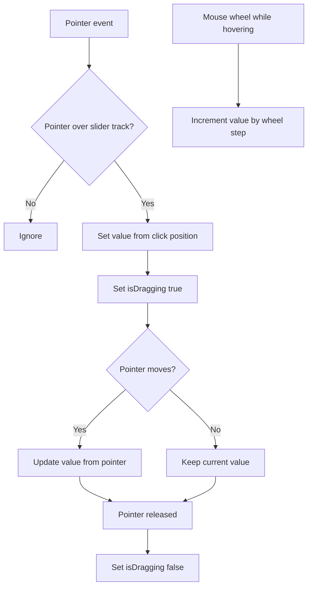

## Layout Editing

`Move Panels` and `Move Elements` are intended for tuning the canvas presentation. Normal users should keep both disabled.

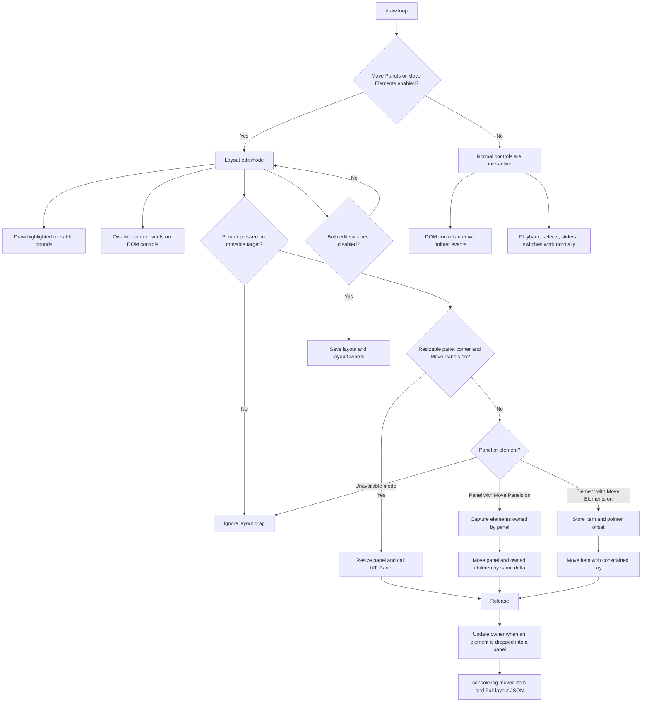

When saved layout data is loaded, persisted coordinates are applied as-is, even if part of the layout is outside the current visible canvas.

## Layout Data

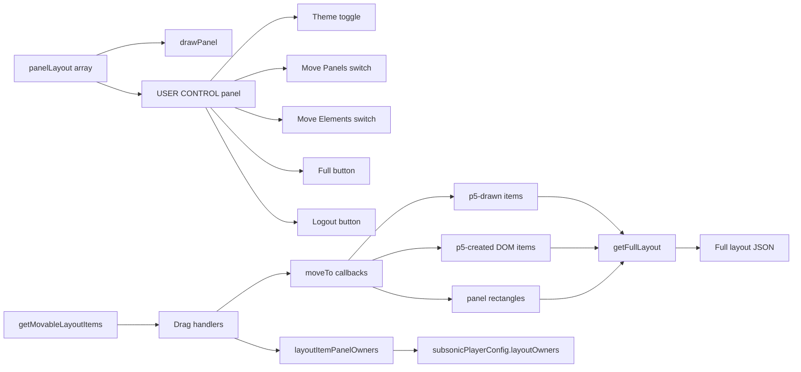

## Audio Routing

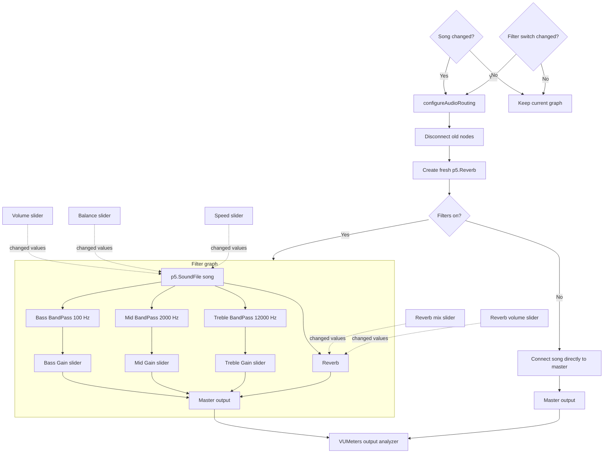

## Local Data Relationships

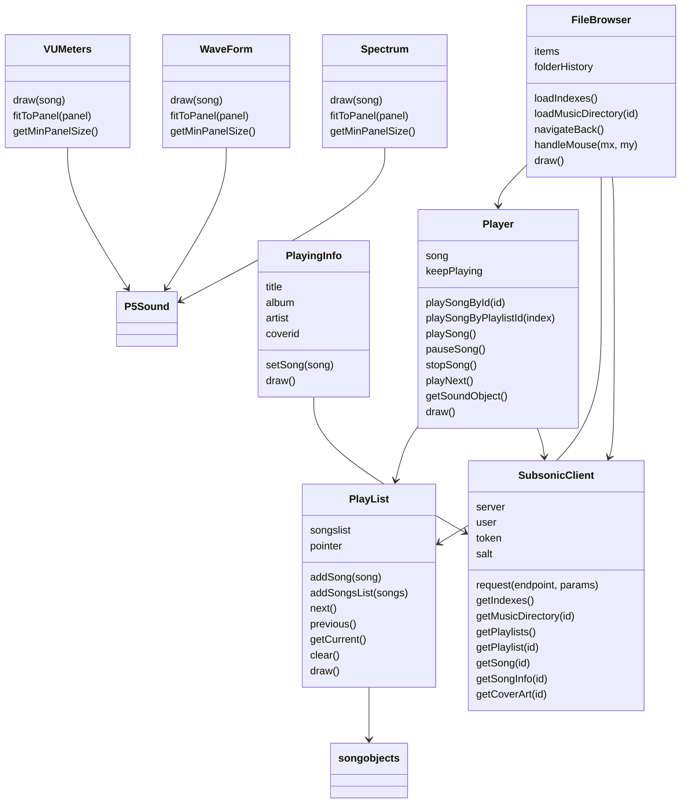
